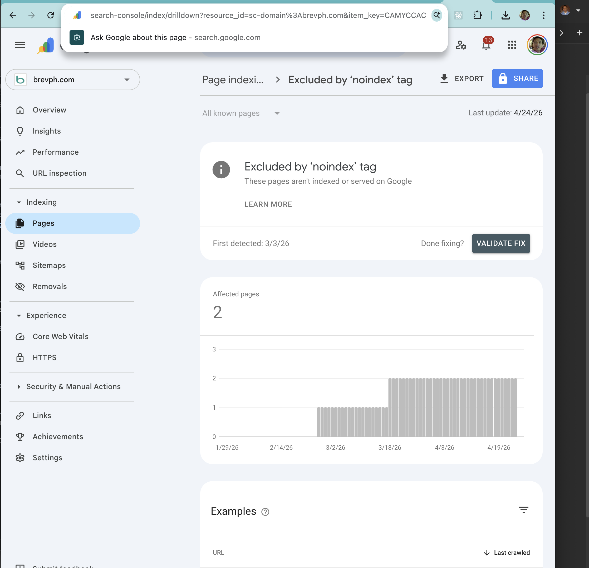

# Deploy Node.js Google Search Console Report Job With Playwright

Upwork Task ID: 30054886

## Job Description

I have a Node.js script which logs in to Google Search Console and downloads a report. I want to deploy this on the cloud and set up a trigger to run this automatically.

Attached is the script. Please check and let me know if this can be done.

## Solution

This project uses Playwright to open Google Search Console, authenticate to Google, visit configured Search Console drilldown reports, scrape report rows from the UI, and write a CSV file.

The original attached script in `attachments/code.txt` used Playwright in a local headed Firefox browser and left the CSV write commented out. This version keeps the Playwright approach, but makes it cloud-ready:

- runs headless by default
- supports Chromium, Firefox, or WebKit
- writes CSV output
- can upload CSV output to Google Cloud Storage or S3
- exposes an HTTP entrypoint for Cloud Run, Google Cloud Functions, or AWS Lambda style handlers
- supports saved Playwright browser state to reduce repeated Google login prompts

## Important Playwright Notes

Playwright can automate the Search Console UI, but Google login is the fragile part of this workflow. A scheduled job can fail if Google requires 2-step verification, CAPTCHA, device approval, or a fresh login challenge.

For the most reliable Playwright deployment, run a local login once with `npm run login`, save the browser state file, and provide that state securely to the cloud runtime. Do not commit `.env` files, passwords, or `.auth/` browser state files.

## What This Exports

The scraper visits each report configured in `GSC_REPORTS_JSON`.

Each CSV row includes:

- `status`
- `report name`
- `url`
- `updated`

The default selectors match the original script:

- report row selector: `.OOHai`
- updated date selector: `.zTJZxd.zOPr2c`

If Google changes the Search Console UI, update `GSC_REPORT_SELECTOR` and `GSC_UPDATED_SELECTOR`.

## Files

- `src/index.js` - local CLI entrypoint
- `src/login.js` - local headed login helper that saves Playwright storage state
- `src/server.js` - HTTP server and AWS Lambda handler export
- `src/job.js` - reusable report job
- `src/playwright-gsc.js` - Playwright Search Console scraper
- `src/storage.js` - writes CSV locally, to Google Cloud Storage, or to S3
- `.env.example` - environment variable template
- `Dockerfile` - Playwright container for Cloud Run or other container platforms

## Local Setup

Install dependencies:

```bash
npm install
```

Create environment variables:

```bash
cp .env.example .env
```

Set at least:

```bash
SITE_URL=sc-domain:example.com
GOOGLE_EMAIL=person@example.com
GOOGLE_PASSWORD=change-me
GSC_REPORTS_JSON=[{"category":"Indexing","name":"Pages drilldown","param":"REAL_ITEM_KEY_VALUE"}]
```

## Find The Search Console `item_key`

The screenshot below shows where the `item_key` appears in the Search Console drilldown page URL.



For a Pages drilldown report:

1. Open `https://search.google.com/search-console`.
2. Select the Search Console property, for example `sc-domain:brevph.com`.
3. Open `Pages` from the left navigation.
4. Click a specific row or issue inside the Pages report. The top-level Pages URL usually does not have `item_key`.
5. After clicking into the detail/drilldown page, copy the value after `item_key=` from the browser address bar.

Example URL:

```text
https://search.google.com/search-console/index/drilldown?resource_id=sc-domain%3Abrevph.com&item_key=CAMYCyAC
```

The `item_key` is:

```text
CAMYCyAC
```

Use the raw `item_key` in `.env`:

```env
GSC_REPORTS_JSON=[{"category":"Indexing","name":"Pages drilldown","param":"CAMYCyAC"}]
```

The full Search Console URL also works:

```json
[{"category":"Indexing","name":"Pages drilldown","param":"https://search.google.com/search-console/index/drilldown?resource_id=sc-domain%3Abrevph.com&item_key=CAMYCyAC"}]
```

For the Pages overview, a URL without `item_key` is accepted by the scraper, but it may not contain the same rows as a specific drilldown page:

```json
[{"category":"Indexing","name":"Pages","param":"https://search.google.com/search-console/index?resource_id=sc-domain%3Abrevph.com"}]
```

Do not use placeholder text or the literal example below:

```text
item_key=ITEM_KEY_FROM_GSC_URL
REAL_ITEM_KEY_VALUE
```

## Save A Browser Session

Google often blocks fully automated login. The expected workflow is to create a browser session locally, then reuse it for scheduled runs.

For the local login step, set these values in `.env` so Playwright opens installed Google Chrome in visible mode:

```env
PLAYWRIGHT_BROWSER=chromium
PLAYWRIGHT_CHANNEL=chrome
PLAYWRIGHT_HEADLESS=false
PLAYWRIGHT_DISABLE_AUTOMATION_CONTROLLED=true
```

Run the login helper:

```bash
npm run login
```

Complete any Google prompt in the opened browser, including 2-step verification, device approval, or account selection. When the login succeeds, the helper saves session state to:

```text
./.auth/gsc-state.json
```

The scraper automatically loads this file on future runs through `STORAGE_STATE_PATH`.

After the session is saved, scheduled or cloud runs can use headless mode again:

```env
PLAYWRIGHT_HEADLESS=true
```

If Google Chrome says the browser or app is not secure, Google has rejected that Playwright-controlled Chrome session. Try Firefox for the login step:

```env
PLAYWRIGHT_BROWSER=firefox
# leave PLAYWRIGHT_CHANNEL unset
PLAYWRIGHT_HEADLESS=false
```

Then run `npm run login` again. The scheduled scraper can reuse the saved `STORAGE_STATE_PATH`.

Some Chromium setups can get past this by launching with `--disable-blink-features=AutomationControlled` and a current desktop user agent. This project enables that Chromium flag by default through `PLAYWRIGHT_DISABLE_AUTOMATION_CONTROLLED=true`. If needed, set `PLAYWRIGHT_USER_AGENT` to a current desktop Chrome user agent string.

Do not commit `.auth/gsc-state.json`. It contains authenticated browser session data.

## Local Run

Run the scraper:

```bash
npm start
```

Successful output looks like:

```text
Extracted Pages drilldown: 10 rows
```

The default local output is:

```text
./reports/gsc-report.csv
```

## Google Cloud Run Deployment

Build and deploy the Playwright container:

```bash
gcloud run deploy gsc-report-job \
  --source . \
  --region us-central1 \
  --set-env-vars SITE_URL=https://example.com/,GCS_BUCKET=my-report-bucket \
  --set-env-vars 'GSC_REPORTS_JSON=[{"category":"Indexing","name":"Example report","param":"EXAMPLE_ITEM_KEY"}]'
```

Create a scheduled trigger:

```bash
gcloud scheduler jobs create http gsc-report-daily \
  --location us-central1 \
  --schedule "0 6 * * *" \
  --uri "https://YOUR_CLOUD_RUN_URL" \
  --http-method GET
```

Set `GCS_BUCKET` to write reports to Google Cloud Storage.

For production, also provide either `GOOGLE_EMAIL` and `GOOGLE_PASSWORD` through a secret manager, or mount/provide the saved `STORAGE_STATE_PATH` file securely. Avoid putting Google credentials directly in deploy commands or source control.

## Google Cloud Functions Deployment

Deploying Playwright directly to Cloud Functions can be harder than Cloud Run because browser dependencies must be packaged correctly. Prefer Cloud Run for this project. If Cloud Functions is required, use a Gen 2 function with a custom container or verify the Playwright browser dependencies are present.

The exported HTTP function is:

```text
runGscReport
```

## AWS Lambda Deployment

The Lambda handler is exported from `src/server.js`:

```text
src/server.handler
```

Required AWS environment variables:

```bash
SITE_URL=https://example.com/
S3_BUCKET=my-report-bucket
GSC_REPORTS_JSON=[{"category":"Indexing","name":"Example report","param":"EXAMPLE_ITEM_KEY"}]
```

AWS Lambda requires a compatible Playwright browser package or layer. In practice, a container image Lambda is usually easier than a zip deployment for Playwright.

For production, provide Google credentials through AWS Secrets Manager or provide the saved Playwright storage state file securely.

## AWS EventBridge Scheduling

Use Amazon EventBridge Scheduler to invoke the Lambda function on a recurring schedule.

EventBridge Scheduler needs an execution role that can invoke the Lambda function. The role trust policy should allow `scheduler.amazonaws.com`, and the permissions policy should allow `lambda:InvokeFunction` on the target function.

Example permissions policy:

```json
{
  "Version": "2012-10-17",
  "Statement": [
    {
      "Effect": "Allow",
      "Action": "lambda:InvokeFunction",
      "Resource": "arn:aws:lambda:us-east-1:123456789012:function:gsc-report-job"
    }
  ]
}
```

Create a daily schedule:

```bash
aws scheduler create-schedule \
  --name gsc-report-daily \
  --schedule-expression "rate(1 day)" \
  --flexible-time-window '{"Mode":"OFF"}' \
  --target '{
    "Arn": "arn:aws:lambda:us-east-1:123456789012:function:gsc-report-job",
    "RoleArn": "arn:aws:iam::123456789012:role/eventbridge-scheduler-lambda-role",
    "Input": "{\"source\":\"eventbridge-scheduler\"}"
  }'
```

For a specific time, use a cron expression instead:

```bash
aws scheduler create-schedule \
  --name gsc-report-weekday-morning \
  --schedule-expression "cron(0 6 ? * MON-FRI *)" \
  --schedule-expression-timezone "UTC" \
  --flexible-time-window '{"Mode":"OFF"}' \
  --target '{
    "Arn": "arn:aws:lambda:us-east-1:123456789012:function:gsc-report-job",
    "RoleArn": "arn:aws:iam::123456789012:role/eventbridge-scheduler-lambda-role",
    "Input": "{\"source\":\"eventbridge-scheduler\"}"
  }'
```

Replace the account ID, region, Lambda function ARN, and scheduler role ARN with the deployed AWS resources.

## Environment Variables

- `SITE_URL` - required Search Console property URL, for example `https://example.com/` or `sc-domain:example.com`
- `GOOGLE_EMAIL` - Google account email for direct login
- `GOOGLE_PASSWORD` - Google account password for direct login
- `GSC_REPORTS_JSON` - required JSON array of report objects with `category`, `name`, and `param`
- `GSC_REPORT_SELECTOR` - optional CSS selector for report rows, default `.OOHai`
- `GSC_UPDATED_SELECTOR` - optional CSS selector for the updated date, default `.zTJZxd.zOPr2c`
- `PLAYWRIGHT_BROWSER` - optional browser, `chromium`, `firefox`, or `webkit`, default `chromium`
- `PLAYWRIGHT_CHANNEL` - optional Chromium channel, for example `chrome` to open installed Google Chrome
- `PLAYWRIGHT_DISABLE_AUTOMATION_CONTROLLED` - optional Chromium flag for Google login compatibility, default `true`
- `PLAYWRIGHT_USER_AGENT` - optional user agent override for Playwright contexts
- `PLAYWRIGHT_HEADLESS` - optional, default `true`
- `STORAGE_STATE_PATH` - optional saved browser state path, default `./.auth/gsc-state.json`
- `LOGIN_TIMEOUT_MS` - optional Google login timeout, default `120000`
- `NAVIGATION_TIMEOUT_MS` - optional page navigation timeout, default `60000`
- `START_DATE` - optional date used in output filenames, `YYYY-MM-DD`
- `END_DATE` - optional date used in output filenames, `YYYY-MM-DD`
- `OUTPUT_FILE` - optional local CSV path
- `GCS_BUCKET` - optional Google Cloud Storage bucket
- `GCS_PREFIX` - optional Google Cloud Storage object prefix
- `S3_BUCKET` - optional AWS S3 bucket
- `S3_PREFIX` - optional AWS S3 object prefix
